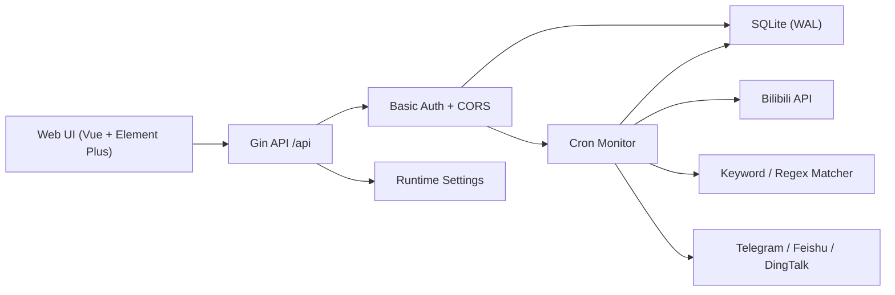

# Goban - Bilibili Comment Monitoring and Auto-Report System

[中文](./README.md)

Goban is a Go + Vue full-stack application for monitoring Bilibili video comments across multiple creators, matching comments with keyword or regular-expression rules, and reporting matched comments with a logged-in Bilibili account. It includes a Web UI, SQLite persistence, Docker deployment, CSV export, whitelist support, Webhook notifications, and monitor status metrics.

> This project is for learning and research only. Follow Bilibili rules, applicable laws, and platform rate limits. You are responsible for the consequences of using it.

## Features

- Bilibili account management: QR login, Cookie login, and Cookie validity checks.
- Multi-creator monitoring: one task can monitor multiple UP user IDs.
- Keyword rules: plain text, regular expressions, single/any/all condition logic, case sensitivity, and live preview.
- Whitelist: skip comments from selected UIDs or usernames.
- Report throttling: global serialized limiter, defaulting to one report every 30 seconds, plus a per-account daily cap.
- Cron scheduler: duplicate-run protection and configurable task concurrency.
- API retries: exponential backoff with jitter for Bilibili API failures.
- Risk-control queue: risk-control and rate-limit errors put tasks into an exponential backoff queue that resumes automatically.
- Comment pagination: fetches multiple comment pages instead of only the first page.
- Monitor status: checked comments, matched comments, report counts, task progress, next run time, and recent errors.
- Long-running task management: the task page shows progress and recent logs, and supports pause, enable, retry now, and reset statistics.
- Report history: filter by task, creator, keyword, status, and time; export CSV.
- Log levels and dedupe: monitor logs use info/warning/error levels and repeated messages are merged with a repeat counter.
- Delete protection: accounts, tasks, rules, and whitelist entries require a second confirmation and backend deletion verification.
- Webhook notifications: Telegram, Feishu, and DingTalk notifications for reports, invalid Cookies, and monitor errors.
- SQLite persistence: accounts, tasks, targets, rules, whitelist, settings, logs, and report records.
- Encrypted Cookie storage: AES-GCM with `GOBAN_SECRET_KEY` or a generated local key file.
- CORS allowlist: browser cross-origin API access is controlled by `ALLOWED_ORIGINS`.
- Login brute-force protection: repeated Basic Auth failures trigger IP-level rate limiting and return 429.
- Protected API docs: OpenAPI/Swagger-compatible documentation is available after Basic Auth.

## Architecture

```text
goban/
├── server/                 Go backend
│   ├── main.go             Entry point
│   └── internal/
│       ├── bili/           Bilibili API client, login, comments, reports
│       ├── config/         Environment configuration
│       ├── controllers/    HTTP API controllers
│       ├── database/       SQLite initialization and default settings
│       ├── middleware/     Basic Auth and CORS allowlist
│       ├── models/         GORM models
│       ├── monitor/        Cron scheduler, executor, limiter, Cookie checks
│       ├── notify/         Telegram, Feishu, and DingTalk Webhooks
│       ├── rules/          Plain and regex matching
│       ├── secure/         Cookie encryption
│       ├── settings/       Runtime settings
│       └── whitelist/      Whitelist matcher
├── web/                    Vue 3 + Element Plus frontend
├── Dockerfile              Multi-stage frontend/backend image build
├── docker-compose.yml      Docker Compose example
└── .github/workflows/      Release and Docker image workflows
```

The backend exposes Gin APIs under `/api`. Production frontend assets are served by the backend. In development, Vite proxies `/api` to the backend.



## Requirements

- Go 1.25+
- Node.js 24+
- npm 10+
- Docker 24+ optional

## Docker

### Docker Compose

```bash
docker compose up -d
```

Open:

```text
http://localhost:38080
```

Default username:

```text
admin
```

If `PASSWORD` is not set, the backend writes a generated password to `.goban_admin_password` in the data directory. With Docker Compose, read it from `./data/.goban_admin_password`. Set `GOBAN_USERNAME`, `PASSWORD`, and `GOBAN_SECRET_KEY` explicitly in production.

### Docker Command

```bash
docker run -d \
  --name goban \
  -p 38080:8080 \
  -e GOBAN_USERNAME=admin \
  -e PASSWORD="$(openssl rand -base64 24)" \
  -e GOBAN_SECRET_KEY="$(openssl rand -base64 32)" \
  -e DB_PATH=/app/data/goban.db \
  -e ALLOWED_ORIGINS=http://localhost:38080 \
  -e TZ=Asia/Shanghai \
  -v "$(pwd)/data:/app/data" \
  --restart unless-stopped \
  spiritlhl/goban:latest
```

### Build Image from Source

```bash
docker build -t goban:local .
docker run -d \
  --name goban \
  -p 38080:8080 \
  -e GOBAN_USERNAME=admin \
  -e PASSWORD="$(openssl rand -base64 24)" \
  -e GOBAN_SECRET_KEY="$(openssl rand -base64 32)" \
  -v "$(pwd)/data:/app/data" \
  goban:local
```

## Manual Development

### Backend

```bash
cd server
go mod download
DB_PATH=../data/goban.db \
GOBAN_USERNAME=admin \
PASSWORD="$(openssl rand -base64 24)" \
GOBAN_SECRET_KEY="$(openssl rand -base64 32)" \
go run .
```

The backend listens on `http://localhost:8080` by default.

### Frontend

```bash
cd web
npm ci
npm run dev
```

The frontend runs on `http://localhost:3000` and proxies APIs to `http://localhost:8080`.

## Environment Variables

| Variable | Description | Default |
| --- | --- | --- |
| `PORT` | Backend port | `8080` |
| `GOBAN_USERNAME` | Web Basic Auth username, preferred to avoid conflicts with shell-level `USERNAME` variables | `admin` |
| `USERNAME` | Backward-compatible Web Basic Auth username variable; ignored when `GOBAN_USERNAME` is set | empty |
| `PASSWORD` | Web Basic Auth password | generated into `.goban_admin_password` when empty |
| `GOBAN_PASSWORD_FILE` | Generated admin password file path | `.goban_admin_password` beside `DB_PATH` |
| `GOBAN_SECRET_KEY` | Cookie encryption key | generated into `.goban_secret_key` when empty |
| `GOBAN_SECRET_KEY_FILE` | Generated Cookie encryption key file path | `.goban_secret_key` beside `DB_PATH` |
| `ALLOWED_ORIGINS` | Comma-separated browser Origins allowed to call the API | local development Origins |
| `DB_PATH` | SQLite database path | `data/goban.db` |
| `DB_MAX_OPEN_CONNS` | Maximum open DB connections | `20` |
| `DB_MAX_IDLE_CONNS` | Maximum idle DB connections | `5` |
| `DB_CONN_MAX_LIFETIME` | DB connection max lifetime in seconds | `3600` |
| `DEBUG` | Gin debug mode | `false` |
| `MAX_CONCURRENT_TASKS` | Maximum concurrent monitor tasks | `2` |
| `cookie_check_interval` | UI setting, Cookie validity check interval | `3600` |
| `cookie_refresh_interval` | UI setting, local Cookie validity refresh window | `21600` |
| `log_dedupe_window_seconds` | UI setting, repeated log merge window | `300` |
| `risk_backoff_base_seconds` | UI setting, risk-control backoff base delay | `1800` |
| `risk_backoff_max_seconds` | UI setting, risk-control backoff maximum delay | `86400` |
| `TZ` | Container timezone | `Asia/Shanghai` |

## Usage

1. Sign in to the Web UI.
2. Add a Bilibili account by QR login or Cookie login.
3. Create keyword rules. `single` keeps the original pattern as-is, while `or` and `and` split conditions by commas, semicolons, or newlines; preview them against sample comments.
4. Add whitelist entries when some users should never trigger reports.
5. Create a monitor task, select an account, enter one or more UP user IDs, choose rules, and configure intervals, daily caps, retries, and proxy settings.
6. Watch counters, progress, next run times, and recent errors in Monitor Status or Monitor Tasks.
7. Filter and export report history in Report Records.
8. Tune defaults and Webhook notifications in Settings.

## Key Configuration Recommendations

- Keep the monitor interval at or above 300 seconds.
- Keep the report interval at or above 30 seconds; the service enforces a 30-second minimum.
- Configure a reasonable daily report cap for each Bilibili account to reduce platform risk-control triggers.
- For high-volume comment sections, lower the per-video comment count or increase task intervals.
- When Bilibili risk control is detected, the task enters the backoff queue automatically; you can clear backoff and retry from the task page.
- Proxy URLs may use `http://host:port`, `socks5://host:port`, or authenticated proxy URLs.
- After 5 consecutive login failures, the source IP is temporarily rate-limited for 15 minutes; a successful login clears that IP's failure counter.
- If `GOBAN_SECRET_KEY` or `.goban_secret_key` changes, previously stored Cookies cannot be decrypted; log in again after rotating keys.
- `/debug/pprof/` is mounted behind Basic Auth for goroutine, heap, mutex, and other runtime diagnostics.

## API Overview

All `/api` endpoints require Basic Auth:

```http
Authorization: Basic base64(username:password)
```

Common endpoints:

- `GET /api/users/list`
- `GET /api/users/login`
- `GET /api/users/loginCheck`
- `POST /api/users/loginByCookie`
- `POST /api/users/:id/check`
- `GET /api/tasks/list`
- `GET /api/tasks/progress`
- `GET /api/tasks/:id/progress`
- `POST /api/tasks/:id/status`
- `POST /api/tasks/create`
- `PUT /api/tasks/:id`
- `GET /api/tasks/:id/test`
- `GET /api/keywords/list`
- `POST /api/keywords/preview`
- `GET /api/whitelist/list`
- `GET /api/status`
- `GET /api/settings` / `PUT /api/settings`
- `GET /api/docs`
- `GET /api/docs/openapi.json`
- `GET /api/logs/monitor`
- `GET /api/logs/report`
- `GET /api/logs/report/export`
- `GET /health` without authentication

## Database

Goban uses SQLite by default. `DB_PATH` controls the database location. Main tables include:

- `bili_users`
- `monitor_tasks`
- `monitor_targets`
- `keyword_rules`
- `whitelist_users`
- `app_settings`
- `monitor_logs`
- `report_records`

This version does not guarantee compatibility with older database schemas. To reinitialize, stop the service, delete the database file pointed to by `DB_PATH`, and start the service again.

## CI/CD

GitHub Actions use Node.js 24 runtime action versions and set workflow timeouts, concurrency groups, least-privilege permissions, and:

```yaml
FORCE_JAVASCRIPT_ACTIONS_TO_NODE24: true
```

The release workflow builds frontend assets and multi-platform backend binaries. The Docker workflow builds `linux/amd64` and `linux/arm64` images.

The repository also includes `scripts/ci_check.sh` for local checks covering Actions configuration, security defaults, OpenAPI presence, and consistency between frontend API calls, backend routes, and documented routes. API docs can be checked separately with `make swagger-check`; CI installs `swag` and runs `swag init` into a temporary directory.

## FAQ

### Where is the first-login password?

If `PASSWORD` is unset, Goban creates `.goban_admin_password` in the data directory. Docker Compose maps that directory to host `./data`.

### Why is a browser request blocked by CORS?

Add the page Origin to `ALLOWED_ORIGINS`. In production, use only the real domain names for your deployment.

### Invalid Cookie

Use the account check action in the Web UI. If the Cookie is invalid, delete the account and log in again.

### Why did reporting stop?

Check monitor logs for whitelist matches, duplicate reports, daily cap hits, Bilibili rate limits, invalid Cookies, or API errors.

### Why can old Cookies no longer be decrypted?

The encryption key changed. Restore the old `GOBAN_SECRET_KEY` or `.goban_secret_key`, or log in again.

### Why does Docker healthcheck fail?

Confirm the service is listening and `GET /health` returns `{"status":"ok"}`.

## Acknowledgements

- [bilibili-API-collect](https://github.com/AkagiYui/bilibili-API-collect)
- [gobup](https://github.com/spiritLHLS/gobup)

## License

See [LICENSE](./LICENSE).
