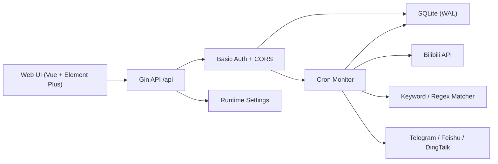

# Goban - B站评论监控与自动举报系统

[English](./README.en.md)

Goban 是一个 Go + Vue 全栈应用，用于监控多个 B 站 UP 主的视频评论区，按关键字或正则规则匹配违规评论，并通过已登录的 B 站账号自动举报。系统提供 Web 管理界面、SQLite 持久化、Docker 部署、举报历史导出、白名单、Webhook 通知和运行状态统计。

> 本项目仅供学习交流使用。请遵守 B 站规则、当地法律法规和平台风控要求，使用后果由使用者自行承担。

## 功能概览

- 多 B 站账号管理：扫码登录、Cookie 登录、Cookie 有效性检测。
- 多 UP 主监控：一个任务可配置多个 UP 主 UID。
- 关键字规则管理：支持普通字符串、正则表达式、单条/任一/全部组合逻辑、大小写敏感开关和实时预览。
- 白名单：按 UID 或用户名跳过特定用户评论。
- 举报限流：全局串行限流，默认每 30 秒最多举报一次，并支持单账号每日举报上限。
- 监控调度：使用 cron 调度，任务运行有重复执行保护和并发上限。
- API 退避重试：B 站 API 请求失败时使用指数退避和随机抖动重试。
- 风控后处理队列：识别风控/限流后进入指数退避队列，到期自动恢复调度。
- 评论分页抓取：按页抓取视频评论，避免只读取第一页。
- 监控状态：展示检测评论数、匹配数、举报数、任务进度、下次运行时间和最近异常。
- 长任务管理：任务页可直接查看进度、最近日志，并支持暂停、启用、立即重试和重置统计。
- 举报历史：支持按任务、UP 主、关键字、状态和时间筛选，并导出 CSV。
- 日志分级与去重：监控日志按 info/warning/error 分级，重复日志会合并计数。
- 删除保护：账号、任务、规则和白名单删除均需要二次确认，并在后端校验删除结果。
- Webhook 通知：举报成功、Cookie 失效和监控异常可推送 Telegram、飞书或钉钉。
- SQLite 持久化：账号、任务、目标、规则、白名单、配置、日志和举报记录均落库。
- Cookie 加密存储：使用 AES-GCM 加密，密钥来自 `GOBAN_SECRET_KEY` 或自动生成的本地密钥文件。
- CORS 白名单：浏览器跨域访问由 `ALLOWED_ORIGINS` 显式控制。
- 登录防爆破：Basic Auth 连续失败会触发 IP 级限流并返回 429。
- 受保护 API 文档：Basic Auth 后可访问 OpenAPI/Swagger 兼容文档。

## 架构说明

```text
goban/
├── server/                 Go 后端
│   ├── main.go             服务入口，初始化配置、数据库、监控服务和路由
│   └── internal/
│       ├── bili/           B站 API 客户端、登录、评论、举报封装
│       ├── config/         环境变量配置
│       ├── controllers/    HTTP API 控制器
│       ├── database/       SQLite 初始化和默认配置
│       ├── middleware/     Basic Auth、CORS 白名单
│       ├── models/         GORM 数据模型
│       ├── monitor/        cron 调度、任务执行、限流、Cookie 检测
│       ├── notify/         Telegram/飞书/钉钉 Webhook
│       ├── rules/          普通关键词和正则匹配
│       ├── secure/         Cookie 加解密
│       ├── settings/       可视化配置读写
│       └── whitelist/      白名单匹配
├── web/                    Vue 3 + Element Plus 前端
│   └── src/components/     账号、任务、规则、白名单、日志、举报、配置和状态页面
├── Dockerfile              前后端多阶段构建
├── docker-compose.yml      Docker Compose 示例
└── .github/workflows/      Release 和 Docker 镜像构建
```

后端通过 Gin 暴露 `/api` 接口，前端生产构建产物由后端静态托管。开发时 Vite 将 `/api` 代理到后端。



## 环境要求

- Go 1.25+
- Node.js 24+
- npm 10+
- Docker 24+（可选）

## Docker 部署

### Docker Compose

```bash
docker compose up -d
```

默认访问地址：

```text
http://localhost:38080
```

默认用户名：

```text
admin
```

未设置 `PASSWORD` 时，后端会在数据目录中生成 `.goban_admin_password`；Docker Compose 挂载到宿主机的 `./data/.goban_admin_password`。生产环境建议显式设置 `GOBAN_USERNAME`、`PASSWORD` 和 `GOBAN_SECRET_KEY`。

### Docker 命令

```bash
docker run -d \
  --name goban \
  -p 38080:8080 \
  -e GOBAN_USERNAME=admin \
  -e PASSWORD="$(openssl rand -base64 24)" \
  -e GOBAN_SECRET_KEY="$(openssl rand -base64 32)" \
  -e DB_PATH=/app/data/goban.db \
  -e ALLOWED_ORIGINS=http://localhost:38080 \
  -e TZ=Asia/Shanghai \
  -v "$(pwd)/data:/app/data" \
  --restart unless-stopped \
  spiritlhl/goban:latest
```

### 从源码构建镜像

```bash
docker build -t goban:local .
docker run -d \
  --name goban \
  -p 38080:8080 \
  -e GOBAN_USERNAME=admin \
  -e PASSWORD="$(openssl rand -base64 24)" \
  -e GOBAN_SECRET_KEY="$(openssl rand -base64 32)" \
  -v "$(pwd)/data:/app/data" \
  goban:local
```

## 手动开发运行

### 后端

```bash
cd server
go mod download
DB_PATH=../data/goban.db \
GOBAN_USERNAME=admin \
PASSWORD="$(openssl rand -base64 24)" \
GOBAN_SECRET_KEY="$(openssl rand -base64 32)" \
go run .
```

后端默认监听 `http://localhost:8080`。

### 前端

```bash
cd web
npm ci
npm run dev
```

前端开发地址为 `http://localhost:3000`，接口代理到 `http://localhost:8080`。

## 环境变量

| 变量 | 说明 | 默认值 |
| --- | --- | --- |
| `PORT` | 后端监听端口 | `8080` |
| `GOBAN_USERNAME` | Web Basic Auth 用户名，推荐使用，避免和部分 Shell 的 `USERNAME` 变量冲突 | `admin` |
| `USERNAME` | Web Basic Auth 用户名兼容变量；设置 `GOBAN_USERNAME` 时忽略 | 空 |
| `PASSWORD` | Web Basic Auth 密码 | 空时自动生成到 `.goban_admin_password` |
| `GOBAN_PASSWORD_FILE` | 自动生成管理员密码的文件路径 | `DB_PATH` 同目录下 `.goban_admin_password` |
| `GOBAN_SECRET_KEY` | Cookie 加密密钥 | 空时自动生成到 `.goban_secret_key` |
| `GOBAN_SECRET_KEY_FILE` | 自动生成 Cookie 加密密钥的文件路径 | `DB_PATH` 同目录下 `.goban_secret_key` |
| `ALLOWED_ORIGINS` | 允许跨域访问 API 的 Origin，多个值用逗号分隔 | 本地开发 Origin 白名单 |
| `DB_PATH` | SQLite 数据库路径 | `data/goban.db` |
| `DB_MAX_OPEN_CONNS` | 数据库最大打开连接数 | `20` |
| `DB_MAX_IDLE_CONNS` | 数据库最大空闲连接数 | `5` |
| `DB_CONN_MAX_LIFETIME` | 数据库连接最大生命周期（秒） | `3600` |
| `DEBUG` | Gin Debug 模式 | `false` |
| `MAX_CONCURRENT_TASKS` | 最大并发监控任务数 | `2` |
| `cookie_check_interval` | UI 配置项，Cookie 有效性检测间隔 | `3600` |
| `cookie_refresh_interval` | UI 配置项，Cookie 本地有效期刷新窗口 | `21600` |
| `log_dedupe_window_seconds` | UI 配置项，重复日志合并窗口 | `300` |
| `risk_backoff_base_seconds` | UI 配置项，风控退避基准时长 | `1800` |
| `risk_backoff_max_seconds` | UI 配置项，风控退避最大时长 | `86400` |
| `TZ` | 容器时区 | `Asia/Shanghai` |

## 使用流程

1. 登录 Web 管理界面。
2. 在“B站账号”中添加账号，可扫码登录或粘贴 Cookie。
3. 在“关键字规则”中创建普通关键词或正则规则；组合逻辑为“单条”时保持原样匹配，“任一/全部”会按逗号、分号或换行拆分多个条件，并可用预览框验证匹配效果。
4. 如有需要，在“白名单”中添加不会触发举报的 UID 或用户名。
5. 在“监控任务”中选择账号，填写一个或多个 UP 主 UID，选择关键字规则并设置频率、每日上限、重试、代理等参数。
6. 在“监控状态”或“监控任务”中查看检测数、匹配数、举报数、进度、下次运行时间和最近异常。
7. 在“举报记录”中筛选历史记录，必要时导出 CSV。
8. 在“系统配置”中调整默认监控参数、Cookie 检查间隔和 Webhook。

## 关键配置建议

- 检查间隔建议不低于 300 秒。
- 举报间隔建议不低于 30 秒，系统会强制最低 30 秒。
- 每个 B 站账号建议配置合理的每日举报上限，避免触发平台风控。
- 高频评论区建议降低每次评论抓取数，或增加任务间隔。
- 出现 B 站风控时，任务会进入退避队列并自动等待；可在任务页手动清除退避并立即重试。
- 如配置代理，格式可使用 `http://host:port`、`socks5://host:port` 或带认证 URL。
- 登录连续失败 5 次后，来源 IP 会被临时限流 15 分钟；成功登录会清理该 IP 的失败计数。
- `GOBAN_SECRET_KEY` 或 `.goban_secret_key` 一旦变更，旧数据库中的 Cookie 将无法解密；若更换密钥，建议重新登录账号。
- `/debug/pprof/` 已挂载并受 Basic Auth 保护，可用于排查 goroutine、heap、mutex 等运行时问题。

## API 概览

所有 `/api` 接口使用 Basic Auth：

```http
Authorization: Basic base64(username:password)
```

主要接口：

- `GET /api/users/list`：账号列表
- `GET /api/users/login`：生成 B 站登录二维码
- `GET /api/users/loginCheck`：轮询二维码登录状态
- `POST /api/users/loginByCookie`：Cookie 登录
- `POST /api/users/:id/check`：检测 Cookie 有效性
- `GET /api/tasks/list`：任务列表
- `GET /api/tasks/progress`：任务进度与最近日志
- `GET /api/tasks/:id/progress`：单任务进度
- `POST /api/tasks/:id/status`：暂停、启用、清退避重试、重置统计或手动设置状态
- `POST /api/tasks/create`：创建任务
- `PUT /api/tasks/:id`：更新任务
- `GET /api/tasks/:id/test`：手动测试任务匹配
- `GET /api/keywords/list`：关键字规则列表
- `POST /api/keywords/preview`：预览规则匹配
- `GET /api/whitelist/list`：白名单列表
- `GET /api/status`：监控状态汇总
- `GET /api/settings` / `PUT /api/settings`：系统配置
- `GET /api/docs`：受保护 API 文档页面
- `GET /api/docs/openapi.json`：OpenAPI 3 JSON
- `GET /api/logs/monitor`：监控日志
- `GET /api/logs/report`：举报记录
- `GET /api/logs/report/export`：导出举报记录 CSV
- `GET /health`：健康检查，无需认证

## 数据库

默认数据库为 SQLite，路径由 `DB_PATH` 控制。默认表包括：

- `bili_users`
- `monitor_tasks`
- `monitor_targets`
- `keyword_rules`
- `whitelist_users`
- `app_settings`
- `monitor_logs`
- `report_records`

当前版本不承诺兼容旧数据库结构。如果需要全新初始化，可以停止服务后删除 `DB_PATH` 指向的数据库文件，再重新启动。

## CI/CD

GitHub Actions 已使用 Node.js 24 runtime 版本的官方 actions，并显式设置超时、并发组和最小权限：

```yaml
FORCE_JAVASCRIPT_ACTIONS_TO_NODE24: true
```

Release workflow 会构建前端产物和多平台后端二进制；Docker workflow 会构建并推送 `linux/amd64` 和 `linux/arm64` 镜像。

本仓库还提供 `scripts/ci_check.sh`，用于本地检测 Actions 配置、安全默认值、OpenAPI 存在性以及前端 API 调用、后端路由、OpenAPI 文档三者是否一致。API 文档可通过 `make swagger-check` 单独检查；CI 会安装 `swag` 并执行 `swag init` 到临时目录。

## 常见问题

### Docker 健康检查失败

请确认容器内服务已启动，并检查 `/health` 是否返回：

```json
{"status":"ok"}
```

### 第一次登录密码在哪里

如果没有设置 `PASSWORD`，服务会在数据目录生成 `.goban_admin_password`。Docker Compose 默认数据目录是宿主机的 `./data`。

### Cookie 失效

在“B站账号”中点击“检测”。如果显示失效，请删除账号后重新登录。

### 浏览器跨域请求被拦截

确认访问页面的 Origin 已加入 `ALLOWED_ORIGINS`。生产环境建议只配置真实域名，不要使用通配符。

### 正则规则无法保存

保存时后端会编译正则表达式。请确认正则语法有效；普通关键词不需要转义。

### 举报记录没有新增

可能原因包括评论未命中规则、用户在白名单中、评论已举报过、达到每日上限、B 站 API 限流、Cookie 失效或举报接口返回错误。请查看“监控日志”和任务的“最近异常”。

## 致谢

- [bilibili-API-collect](https://github.com/AkagiYui/bilibili-API-collect)
- [gobup](https://github.com/spiritLHLS/gobup)

## 许可证

见 [LICENSE](./LICENSE)。
